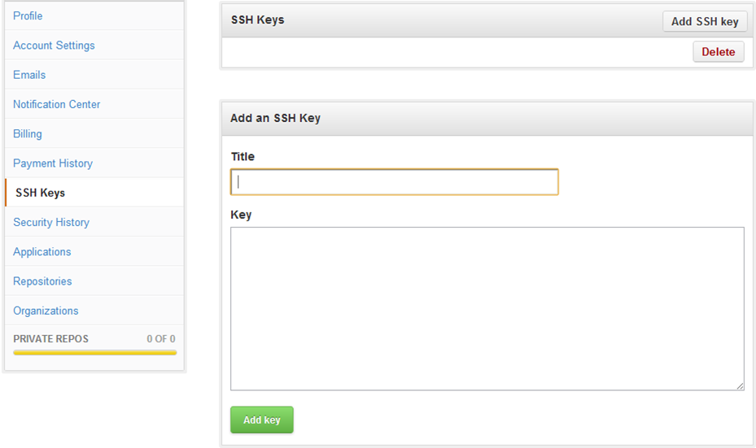

#Github
[TOC]
### 1. 安装
>sudo apt-get install git git-core git-gui git-doc git-svn git-cvs gitweb gitk git-email git-daemon-run git-el git-arch

### 2.SSH认证
```
ssh -T git@github.com
```
>执行之后提示：Permission denied (publickey).

这说明我们还没有在GitHub账户中正确设置公钥认证，如下图所示：

```
$ cd ~/. ssh 检查本机的ssh密钥
```
接下来通过Ubuntu下的ssh-keygen命令创建公钥/私钥对：

```github
ssh-keygen -C "yourname@gmail.com" -f ~/.ssh/github
```
然后将~/.ssh/github.pub公钥中的内容复制到剪贴板，公钥是一行长长的字符串，注意在粘贴时不要加入多余的空格、换行符等，否则在公钥认证过程当中因为服务端和客户端公钥不匹配而导致认证失败。最后将正确的公钥内容拷贝到GitHub的Key文本框中，并为这个ssh起个名字，保存即可。

设置成功后，用Terminal用ssh命令访问GitHub，会显示一条认证成功的消息并退出。


```github
ssh -T git@github.com
```
>执行后提示：Hi github! You've successfully authenticated, but GitHub does not provide shell access.

### 3.设置用户信息
```github
$ git config --global user.name "defnngj"//给自己起个用户名
$ git config --global user.email  "defnngj@gmail.com"//填写自己的邮箱
```

### 4.基本操作
* 提交代码修改步骤：
```
git add.
git commit -m "some thing to say"
git push origin master 
```
* 获取git仓库
```
git clone git@github.com:matrix889/note.git
```

### 5.其他常用指令
```
git init # 初始化本地Git版本库
git add # 暂存文件，如果使用.表示当前目录及其子目录
git commit -m “first commit” # 提交，-m选项后跟内容为提交所用的注释
git remote -v # 查看当前项目远程连接的是哪个版本库地址
git push origin master # 将本地项目提交到远程版本库

git fetch origin # 取得远程更新（到origin/master），但还没有合并
git merge origin/master # 把更新的内容（origin/master）合并到本地分支（master）
git pull origin master # 相当于fetch和merge的合并，但分步操作更保险
```

### 6. 参考资料
[git/github初级运用自如](www.cnblogs.com/fnng/archive/2012/01/07/2315685.html)


